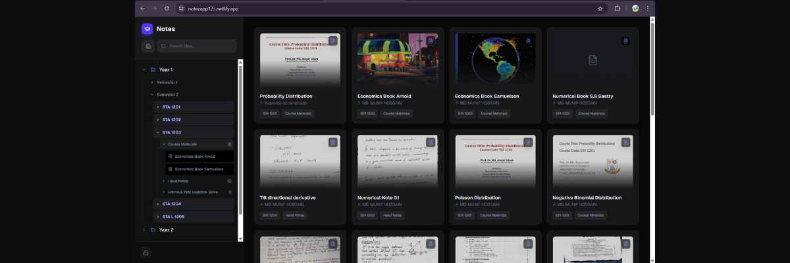

# 🎓 My Uni Hub



> A centralized, web-based platform for managing, storing, and organizing university notes and academic resources.

## 📖 About The Project

**My Uni Hub** was developed to solve the common student problem of scattered notes and disorganized study materials. It serves as a unified digital hub where users can easily upload, categorize, and access their academic files. By integrating secure cloud storage and real-time database capabilities, the application ensures that study materials are always organized and accessible from anywhere.

## ✨ Key Features

* **Seamless File Management:** Easily upload, download, and organize lecture notes, assignments, and reference materials.
* **Real-time Database:** Instant updates and synchronized data retrieval.
* **Intuitive UI/UX:** A clean, responsive design built for ease of use across both desktop and mobile devices.
* **Cloud Storage Integration:** Reliable backend architecture for secure document hosting and retrieval.

## 🛠️ Built With

This project was built using modern web development technologies:

* **Frontend:** React.js, HTML5, CSS3, JavaScript (ES6+)
* **Backend / Database:** Firebase (Realtime Database / Firestore)
* **Storage:** Google Drive API Integration
* **Hosting:** Supabase hosting

## 🚀 Getting Started

To get a local copy up and running, follow these simple steps.

### Prerequisites

* Node.js and npm installed on your machine.
    ```sh
    npm install npm@latest -g
    ```

### Installation

1. Clone the repo:
   ```sh
   git clone [https://github.com/your-username/my-uni-hub.git](https://github.com/your-username/my-uni-hub.git)

Navigate to the project directory:

Bash
```
cd my-uni-hub
Install NPM packages:
```
Bash
```
npm install
```
Set up your environment variables. Create a .env file in the root directory and add your Firebase/API configuration:

JavaScript
```
REACT_APP_FIREBASE_API_KEY=your_api_key
REACT_APP_FIREBASE_AUTH_DOMAIN=your_auth_domain
REACT_APP_FIREBASE_PROJECT_ID=your_project_id
REACT_APP_FIREBASE_STORAGE_BUCKET=your_storage_bucket
REACT_APP_FIREBASE_MESSAGING_SENDER_ID=your_messaging_sender_id
REACT_APP_FIREBASE_APP_ID=your_app_id
```
Start the development server:

Bash
```
npm start
```
💡 Usage
Once the application is running, users can create an account (or log in) to access their dashboard. From the dashboard, you can create new subject folders, upload PDF/Word notes, and utilize the search functionality to quickly find specific study materials before exams.

👨‍💻 Author
MD. MUNIF HOSSAIN

LinkedIn: https://www.linkedin.com/in/md-munif-hossain


Portfolio: Your Portfolio URL

📝 License
Distributed under the MIT License. See LICENSE for more information.
